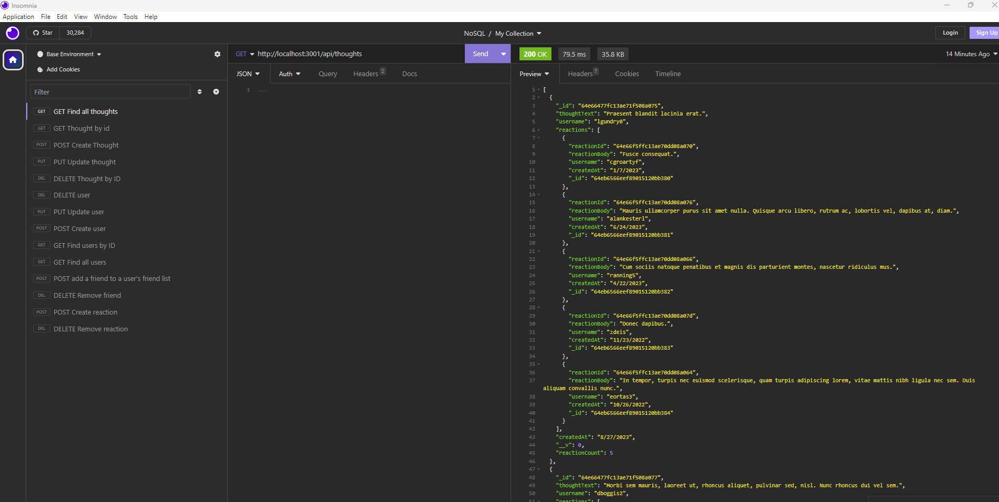

# NoSQL Social Network API

## Description/What I attempted to do

Build an API for a social network so users can share their thoughts and add reactions to others' thoughts. You can also create a friend list. As part of this project, I learned how to use Express.js and Mongoose together.

## Table of Contents

### [Usage](#usage)

### [License](#license)

### [Contributing](#contributing)

### [Questions](#questions)

## Usage

Enter nodemon server.js in the terminal. Use Insomnia to run the GET, POST, PUT and DELETE routes and see how they work. The user can view the users, thoughts, friend lists.

## License

The license for this project is MIT and the link for license information is https://opensource.org/licenses/MIT.

## Contributing/Acknowledgements

Tips from University of Minnesota Full Stack Bootcamp instructor Gary Almes and notes from class sessions.

Tips from class TA Katy Vincent.

Tips from tutoring session with Alexis San Javier through University of Minnesota coding boot camp.

Information on Mongoose email matching located here: https://masteringjs.io/tutorials/mongoose/mongoose-validate-unique-email

## Questions

Please find more information at my GitHub, located [here](https://github.com/Jacqueline-Stiehl).
If you have additional questions, please contact me at salsajackie@yahoo.com.

## Screen shot

## Link to the working version of the code

https://github.com/Jacqueline-Stiehl/orm-ecommerce

## Link to walkthrough video

https://watch.screencastify.com/v/CzQ2eKVVoxhSFH8ChD3f
